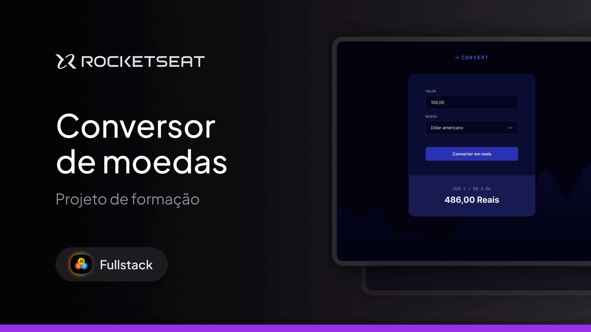

# 💱 Convert App

  Currency converter developed as part of the <strong>Rocketseat Fullstack</strong> formation — this project concludes the first module focused on JavaScript.

  <a href="#-about-the-project">About</a>&nbsp;&nbsp;&nbsp;|&nbsp;&nbsp;&nbsp;
  <a href="#-technologies">Technologies</a>&nbsp;&nbsp;&nbsp;|&nbsp;&nbsp;&nbsp;
  <a href="#-layout">Layout</a>&nbsp;&nbsp;&nbsp;|&nbsp;&nbsp;&nbsp;
  <a href="#memo-license">License</a>

  

 

  

---

## 🚀 About the Project

**Convert** is an improved version of a currency converter that started as a manual project, where exchange rates had to be updated by hand. After revising and refactoring the code, I automated the process by integrating an external API for real-time updates. 

This update was particularly challenging since I only knew the basics of JavaScript before. After two days of intense work, trying and testing different APIs, I finally managed to automate the conversion process. Although it was frustrating at times, especially with many failures, the experience taught me a lot and helped me strengthen my skills in **JavaScript**, **API integration**, and **DOM manipulation**.

Now, users can input an amount, choose a currency, and instantly see the conversion with real-time exchange rates pulled from the API.

---

## 🛠 Technologies

This project was developed using:

- HTML
- CSS
- JavaScript
- DOM Manipulation
- External API (for real-time exchange rates)
- Git & GitHub
- Figma
- Responsiveness techniques

---

## 🔗 Live Project

➡️ [Access the live version](https://andreskull2.github.io/conversor/)  
🎓 [Watch the classes](https://www.rocketseat.com.br/formacao/fullstack)

---

## 🎨 Layout

You can check out the original layout here:

🔗 [View on Figma](https://www.figma.com/community/file/1360315742205904074) *(requires a Figma account)*

---

## :memo: License

This project is licensed under the **MIT License**.  
Feel free to use it as a reference or learning material — just remember to give credit where it’s due.

---

Made with ♥ by Rocketseat — Rebuilt with care by @andreskull2 🚀  
:wave: [Join our community!](https://discord.gg/rocketseat)
